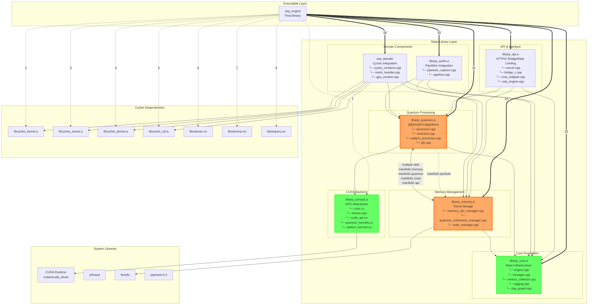
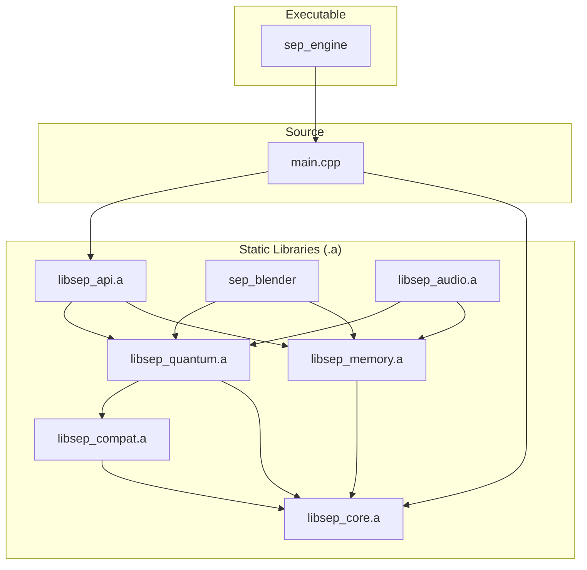
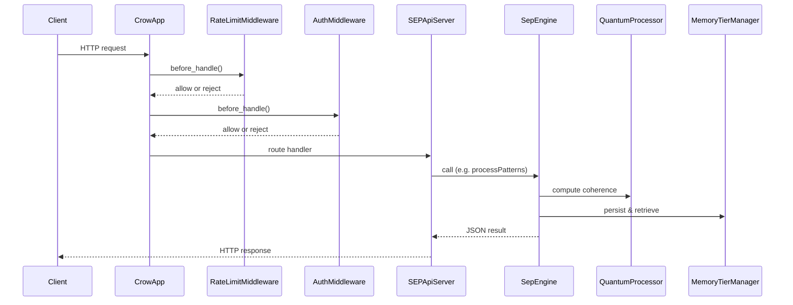
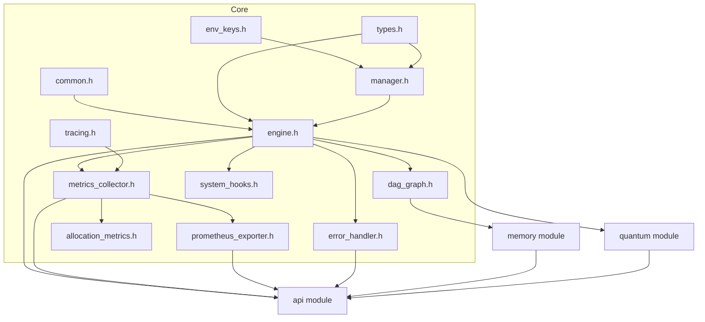
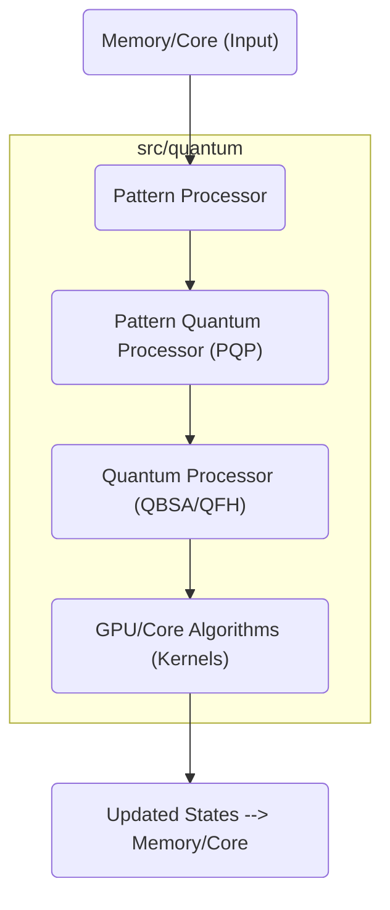
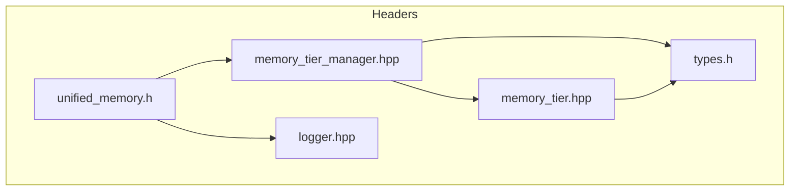
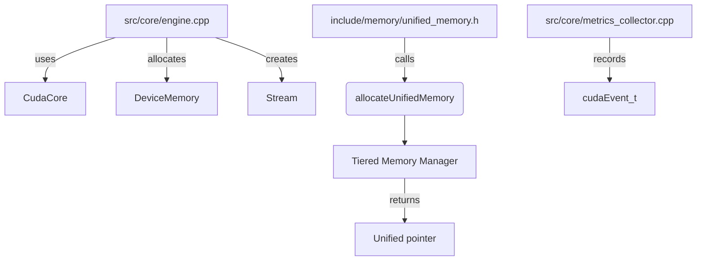
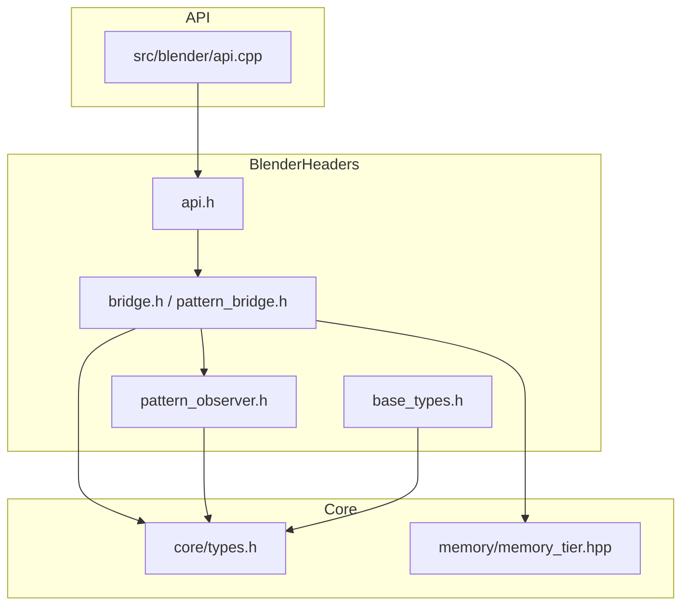
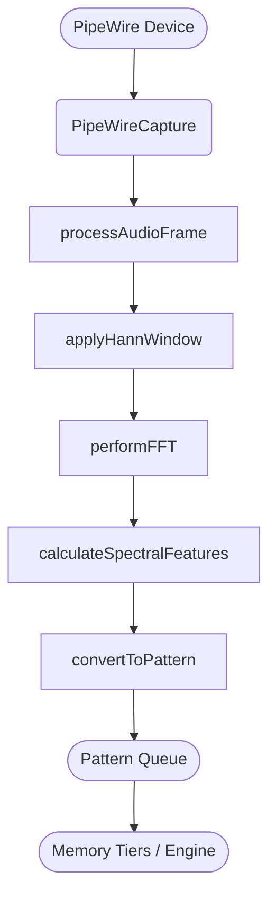

# SEP Engine: System Architecture

## 1. Introduction

The SEP Engine is a high-performance C++ framework for quantum-inspired pattern analysis and evolution. It is designed to be a modular, scalable, and maintainable platform for simulating and exploring the principles of the **Recursive Framework for Emergent Reality**. The architecture prioritizes a clear separation of concerns, allowing for independent development and testing of its core components while enabling complex, emergent behaviors through their interaction.

This document provides a comprehensive overview of the engine's architecture, from the high-level system composition down to the detailed interaction flows between modules.

### Guiding Principles

The architecture is guided by these principles:

1.  **Clear Component Boundaries**: Each module has a distinct responsibility and a well-defined public interface located in `/include/sep`.
2.  **Unidirectional Dependencies**: High-level modules (like `api`) can depend on low-level modules (like `core`), but not the other way around. This prevents circular dependencies and promotes a clean build process.
3.  **Standard Project Layout**: The project follows a standard layout (`src`, `include`, `tests`, `third_party`, `assets`) for better tooling integration and developer onboarding.
4.  **Consolidation of Core Logic**: Cross-cutting concerns like logging, metrics, error handling, configuration, and the Directed Acyclic Graph (DAG) are unified into a single, foundational `core` library.
5.  **Isolate External Dependencies**: Third-party libraries (e.g., Crow, nlohmann, hiredis) are kept separate from the engine's source code and are linked appropriately during the build process.

## 2. High-Level System Diagram

The SEP Engine is compiled into a single executable, `sep_engine`, which links a set of self-contained static libraries. This design ensures modularity and allows for optional components (like Blender or audio integration) to be included or excluded at build time. The dependency graph is strictly unidirectional, flowing from high-level interfaces down to the foundational core.

## 3. Component Breakdown

Each module is built as a self-contained static library, providing a clear and reusable unit of functionality.

### `core` - The Foundation
*   **Purpose**: Provides the foundational utilities, data structures, and managers required by all other engine modules. It has no dependencies on other SEP modules.
*   **Key Files**: `engine.cpp`, `manager.cpp` (ConfigManager), `metrics_collector.cpp`, `error_handler.cpp`, `dag_graph.cpp`.
*   **Dependencies**: None.
*   **Rationale**: The previous `config`, `metrics`, and `dag` modules were merged into `core` to create a single, robust foundational library (`libsep_core.a`), which simplifies the dependency graph significantly.

### `compat` - CUDA Backend & Shims
*   **Purpose**: Provides the complete CUDA backend for GPU acceleration, along with compatibility shims required for building in non-GPU environments.
*   **Key Files**: `core.cu` (CudaCore singleton), `quantum_kernels.cu`, `pattern_kernels.cu`, `raii.cpp` (RAII wrappers).
*   **Dependencies**: `core`.
*   **Rationale**: This module abstracts all GPU-specific implementations, allowing the rest of the engine to remain portable.

### `quantum` - The Algorithms
*   **Purpose**: Contains the "secret sauce"—the quantum-inspired algorithms for analyzing and evolving patterns, including QBSA and QFH.
*   **Key Files**: `qbsa.cpp`, `qfh.cpp`, `evolution.cpp`, `processor.cpp`.
*   **Dependencies**: `core`, `compat`.

### `memory` - Tiered Storage System
*   **Purpose**: Manages the three-tiered memory hierarchy (STM, MTM, LTM) and handles optional pattern persistence via Redis.
*   **Key Files**: `memory_tier_manager.cpp`, `memory_tier.cpp`, `redis_manager.cpp`.
*   **Dependencies**: `core`.

### `embeddings` - Text Embedding Utilities
*   **Purpose**: Supplies lightweight text embeddings for pattern generation and testing.
*   **Key Files**: `simple_embedding_model.cpp`, `simple_embedding_model.h`.
*   **Dependencies**: None.
*   **Diagrams**: [include-embeddings.md](diagrams/include-embeddings.md), [src-embeddings.md](diagrams/src-embeddings.md).

### `api` - The Public Interface
*   **Purpose**: Exposes the engine's functionality to the outside world via an HTTP server (Crow) and a stable C-style bridge.
*   **Key Files**: `server.cpp`, `sep_engine.cpp` (facade), `bridge_c.cpp`, `rate_limit_middleware.cpp`.
*   **Dependencies**: `core`, `quantum`, `memory`.

### `blender` & `audio` - Specialized Integrations
*   **Purpose**: These are optional, platform-specific integrations that can be enabled or disabled at build time.
*   **Key Files**:
    *   **blender**: `api.cpp`, `blender_integration.cpp`, `mesh_handler.cpp`, `cycles_renderer.cpp`.
    *   **audio**: `pipewire_capture.cpp`, `pipeline.cpp`.
*   **Dependencies**: `core`, `quantum`, `memory`.
*   **Rationale**: Keeping these integrations as separate modules prevents their specific dependencies (e.g., Blender headers, PipeWire) from polluting the core engine build.
*   **Cycles Integration**: The `cycles_renderer.cpp` provides pattern-driven rendering through Blender's Cycles renderer when `SEP_HAS_CYCLES` is enabled.
*   **Cycles Source**: Headers are accessed via the `include/cycles_src` symlink. See [include-cycles_src.md](diagrams/include-cycles_src.md) for details.

## 4. Detailed Interaction and Data Flows

The following diagrams illustrate how data and control flow between and within the modules.

### HTTP API Request Flow
This sequence shows how an external HTTP request is processed, from the web server down to the core engine components and back.

### Core Module Dependency Map
The `core` module provides foundational services consumed by nearly every other part of the engine.

### Quantum Processing Flow
This diagram illustrates the pipeline for processing pattern data through the quantum-inspired algorithms.

### Memory Management Flow
The tiered memory system manages the lifecycle of patterns based on their coherence and stability.

### CUDA Compatibility Layer
The `compat` module abstracts GPU interactions, allowing other modules to remain portable.

### Specialized Integration Flows

#### Blender Integration
`src/blender` provides the C API and visualization pipeline for rendering SEP patterns.

#### Audio Integration
`src/audio` captures audio via PipeWire and converts it into pattern vectors for the engine.

## 5. Conclusion

This architecture establishes a clean, modular, and high-performance foundation for the SEP Engine. By separating core logic from interfaces and platform-specific implementations, the system is well-positioned for future expansion, testing, and application. The unidirectional dependency flow ensures maintainability and simplifies the build process, while the tiered memory and quantum processing modules provide the power and flexibility needed to explore the principles of the Recursive Framework for Emergent Reality.