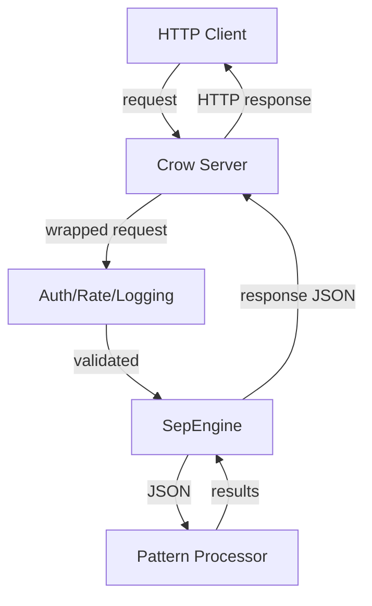
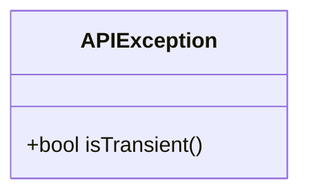
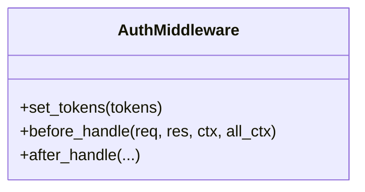
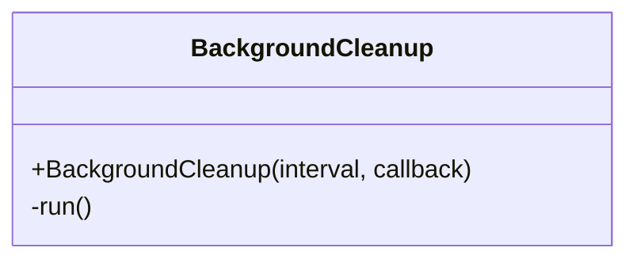
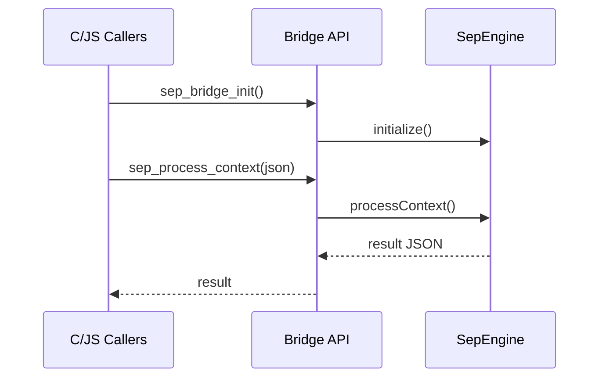

# API Header Overview

This document summarizes the contents of the `include/api/` directory. It shows how data enters and leaves the API layer and highlights the key structures and functions in each header. The diagrams use Mermaid syntax.

## Data Flow

The API layer acts as an interface between external clients (HTTP requests or C/JS bindings) and the internal engine. The high level data path is:



## Header Breakdown

### `api_exception.h`
Defines `APIException`, a custom `std::runtime_error` with a `transient_` flag to signal retryable errors.



### `auth_middleware.h`
Provides `AuthMiddleware` that checks bearer tokens before a request reaches the engine.



### `background_cleanup.h`
Runs background maintenance tasks such as cleaning rate‑limit windows.



### `bridge.h` / `bridge.hpp`
Expose a C interface for native or JS callers. Functions like `sep_bridge_init` and `sep_process_context` marshal JSON to the engine.


```

### `bridge_internal.hpp`
Holds global state used by the bridge (last error, callbacks, processor instance). Provides helpers for setting errors and buffer sizes.

### `client.h`
HTTP client utilities with `Client` and `CurlHttpClient` used by internal services to call out to other APIs.

### `connection_manager.h`
Abstracts socket pooling and connection reuse for outbound calls.

### `crow_adapter.h` / `crow_adapter_impl.h`
Adapters that convert Crow framework requests/responses to the generic `HttpRequest` and `HttpResponse` interfaces.

### `crow_request.h`
Implementation of `IRequest` for Crow, exposing headers, method, URL and body.

### `crow_request_adapter.h`
Wraps a `crow::request` in the generic `HttpRequest` interface used by the
middleware chain.

### `js_integration.h`
Provides a minimal wrapper (`JSIntegration`) for JavaScript bindings. `processContextCheck` takes JSON strings and returns JSON.

### `json_helpers.h`
Convenience functions for parsing/serializing JSON strings.

### `lock_free_rate_limiter.h`
Implements `IRateLimiter` with per-client windows and adaptive throttling based on system metrics.

### `logging_middleware.h`
Middleware that logs each request and response using the engine's logging facilities.

### `ollama_types.h`
Structures describing requests/responses for the Ollama client (e.g., embeddings or text generation).

### `ollama_client.h`
High-level HTTP client that calls an Ollama server using the structures defined above.

### `rate_limit_middleware.h`
Crow middleware integrating the rate limiter before the engine processes requests.

### `rate_limiter.h`
Abstract interface for rate limiter implementations.

### `request_interface.h`
Defines the abstract `IRequest` base class used across adapters.

### `sep_engine.h`
Singleton providing the main API for pattern processing, embeddings, and other high level operations.

### `server.h`
Defines `SEPApiServer` which ties together the Crow server, middleware, and `SepEngine` to form the running HTTP API service.

### `types.h`
Common enums and structures for HTTP status codes, request/response types, and health metrics.

