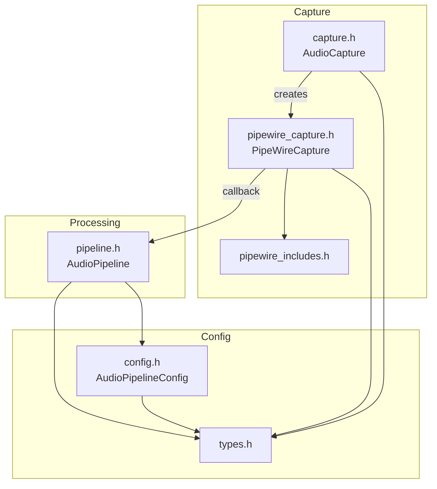

# Audio Module Overview

This diagram summarizes how the headers under `include/audio/` interact with each other and with the rest of the engine. The flow focuses on data movement from audio capture through pattern extraction.

`AudioCapture` defines the virtual interface for audio input. `PipeWireCapture` implements this interface using the PipeWire API (wrapped by `pipewire_includes.h`). Captured sample buffers are forwarded via callback into `AudioPipeline`, which performs FFT analysis and spectral feature calculations. Configuration and metrics types originate from `types.h` and are reused across the module. `config.h` extends these basics with pipeline settings and coherence helpers that guide processing in `pipeline.h`.
