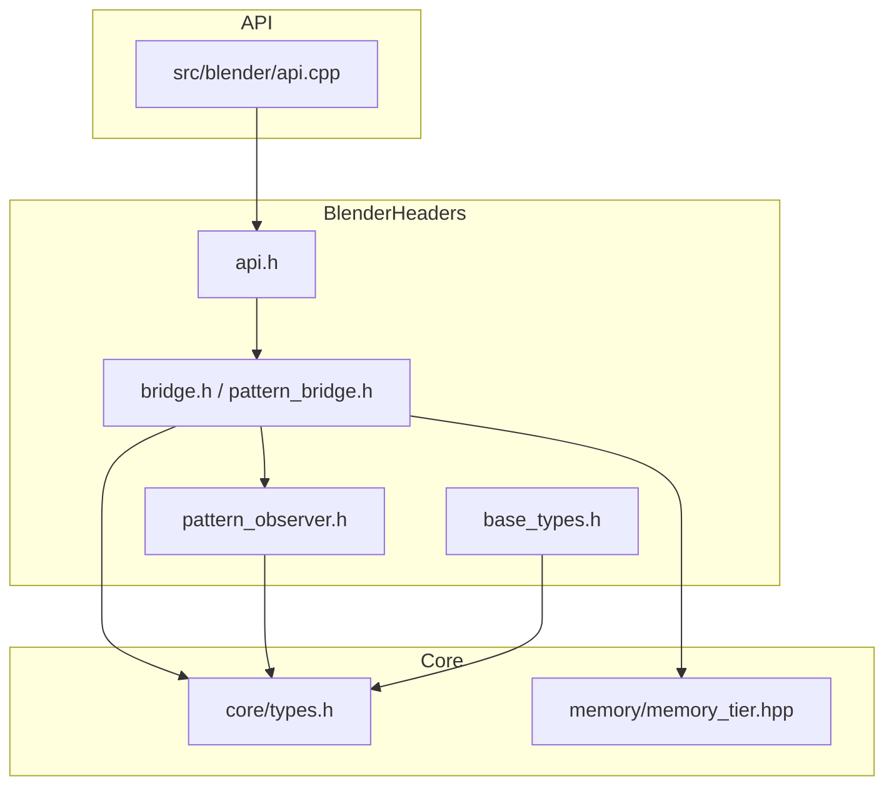

# Blender Include Integration

This document diagrams how headers in `include/blender/` interact with the rest of the engine. It focuses on the objects instantiated by these headers and the outputs that flow to other modules such as `core` and `api`.

## Overview

The Blender integration layer exposes a thin C interface in `src/blender/api.cpp` while the majority of the logic resides in headers under `include/blender/`.
Key components are:

- **`api.h`** – C bindings that external modules (e.g. the API library) use.
- **`bridge.h` / `pattern_bridge.h`** – Implementation of the `BlenderBridge` class and helpers.
- **`base_types.h`** – Fundamental types used across the Blender bridge.
- **`pattern_observer.h`** – Observer interface notified about pattern updates.

These headers depend on utilities from `core/`, `memory/`, and `quantum/`.

## Communication Diagram

## Objects and Outputs

- **`SEPBlenderBridge`** (defined in `include/blender/types.h`)
  - Holds a `std::shared_ptr<sep::pattern::BlenderBridge>` instance.
  - Provides access to `SEPAudioMetrics` and `SEPPatternMetrics` produced during processing.
- **`sep::pattern::BlenderBridge`** (declared in `bridge.h`)
  - Coordinates pattern processing via `PatternProcessor` from `quantum/`.
  - Notifies `PatternObserver` instances when pattern metrics change.
  - Outputs updated `PatternMetrics` structures that may promote patterns across memory tiers.

External modules, especially the API layer, call the C functions in `api.h` which delegate to the `BlenderBridge` class. The results—such as updated meshes or audio metrics—are then returned through these structures and consumed by the rest of the engine.

