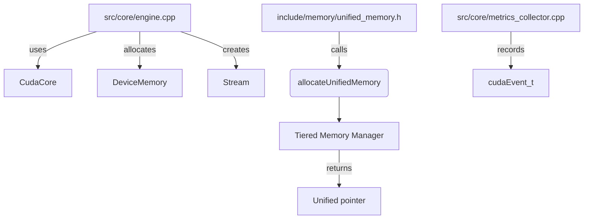

# Compatibility and CUDA Helper Consumption

This overview highlights how the engine's compatibility layer (the `compat` headers) is imported by other parts of the code base. Modules pull in CUDA helpers, memory RAII utilities and shim types to remain portable. Below is a summary of the primary connections.

## Key Imports

- **Core module** (`src/core`)
  - `compat/core.h` for the `CudaCore` singleton
  - `compat/memory.h` and `compat/raii.h` for `DeviceMemory` and RAII buffers
  - `compat/stream.h` for the `Stream` wrapper
- **Memory module** (`include/memory` and `src/memory`)
  - `compat/raii.h` and `compat/memory.h` to implement `UnifiedMemory`
- **Quantum and Blender modules**
  - `compat/math_common.h` and `compat/shim.h` to compile kernels or utility code on both CPU and GPU

The `compat` headers expose unified abstractions so that the rest of the project can allocate device buffers, launch kernels and synchronize streams without direct CUDA dependencies.

## Include Relationships

The diagram shows how core engine code instantiates CUDA resources. Memory helpers forward to the tiered memory manager and deliver unified pointers back to the caller. Metrics collection relies on CUDA events when available.
