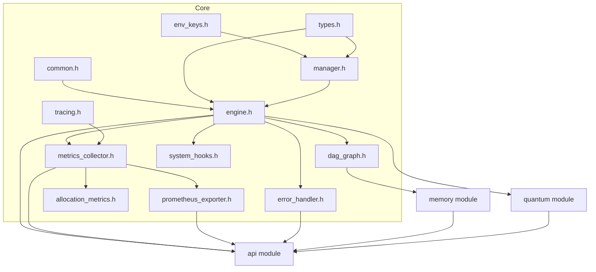

# Core Header Dependency Map

This document illustrates how data flows through the headers inside
`include/core` and how they connect to higher level modules such as
`api`, `quantum`, and `memory`. Each header is represented by a Mermaid
node. Arrows show the primary direction of data or control flow.

### Notes

- **Configuration flow**: `env_keys.h`, `types.h`, and `manager.h` work
together to load configuration values which are then consumed by
`engine.h` and other modules.
- **Metrics flow**: `metrics_collector.h` gathers performance data. It
feeds `prometheus_exporter.h` and `allocation_metrics.h` so metrics can
be published through the `api`.
- **DAG updates**: `dag_graph.h` tracks pattern lineage and is mainly
manipulated by the engine and `memory` module.
- **Error handling**: `error_handler.h` centralizes reporting from core
and higher-level modules.
- **System hooks**: `system_hooks.h` provides callbacks that modules can
implement to observe engine events.
