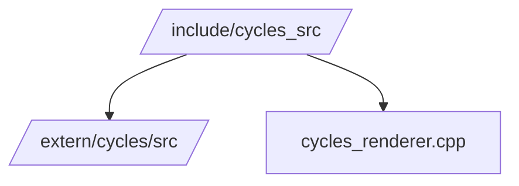

# Cycles Source Symlink

`include/cycles_src` is a convenience link to the Blender Cycles source tree. It allows the engine's `blender` module to reference Cycles headers without hardcoding absolute paths.

The symlink mirrors `extern/cycles/src` so that files like `src/blender/cycles_renderer.cpp` can include headers such as `kernel/kernel.h` when `SEP_HAS_CYCLES` is enabled.
