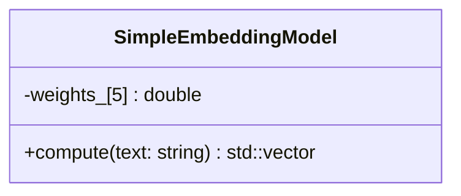

# Embedding Headers Overview

## Header Breakdown

### `simple_embedding_model.h`
Defines `sep::embeddings::SimpleEmbeddingModel`, a lightweight class that transforms a string into a fixed‑size vector.

