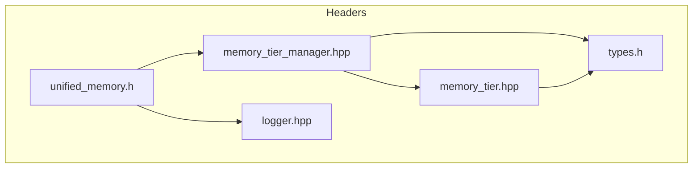

# Memory Management Headers

This document diagrams the relationships between the headers in `include/memory` and highlights their APIs. The tiered memory system exposes several classes that coordinate allocations between Short‑Term (STM), Medium‑Term (MTM), and Long‑Term (LTM) memory pools.

## Key APIs

### memory_tier.hpp
- **`MemoryBlock`** – structure describing a block's pointer, size and metadata.
- **`MemoryTier`** – manages a contiguous pool; provides `allocate`, `deallocate`, and `defragment`.

### memory_tier_manager.hpp
- **`MemoryTierManager`** (singleton)
  - `allocate(std::size_t, TierType)` and `deallocate(MemoryBlock*)`
  - `getSTM()`, `getMTM()`, and `getLTM()` to access tier objects
  - Promotion/demotion: `promoteBlock()` and `demoteBlock()`
  - Pattern operations like `launch_pattern_processing()` tie into `quantum` and `core` modules via `dag_graph` and `pattern` APIs.

### unified_memory.h
- **`UnifiedMemory<T>`** – RAII wrapper for CUDA unified memory.
- **CUDA helpers** `allocateDeviceMemory()`, `freeDeviceMemory()`, `allocateUnifiedMemory()`, `freeUnifiedMemory()` use the CUDA runtime when available and fall back to standard allocations on the host when CUDA is disabled.

### logger.hpp
- Minimal logger interface used by the memory subsystem for diagnostics.

### types.h
- Shared types for patterns, relationship metadata, and the `RedisManager` used by the long‑term tier.

## Module Interactions

The memory subsystem collaborates with other modules:

- **`core`** – Supplies the `dag_graph` and hooks for metrics and system events.
- **`quantum`** – Defines `Pattern` structures and coherence calculations used when promoting or pruning blocks.
- **`compat`** – Provides CUDA wrappers and RAII helpers used throughout the memory code.

Each tier monitors fragmentation and utilization. When thresholds are crossed, `MemoryTierManager` triggers promotion or demotion across STM, MTM, and LTM, optionally persisting data via the `RedisManager`.
