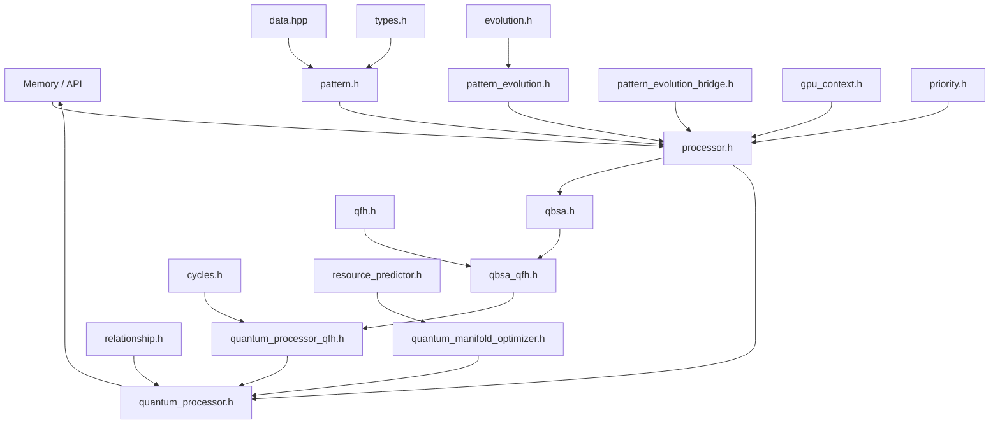

# Quantum Processing Header Flow

This chart outlines how data moves through the quantum-processing headers in the SEP engine. Patterns originate either from in-memory data structures or via the engine's HTTP API. They then pass through several stages of analysis before results are stored back in memory or returned through the API.

**Header Roles**

- `cycles.h` – Implements `QuantumRenderer` for iterative scene evolution.
- `data.hpp` – Core structures describing quantum states and pattern metrics.
- `evolution.h` – Utility helpers to drive pattern evolution cycles.
- `gpu_context.h` – Abstraction layer for GPU resources used by kernels.
- `pattern.h` – Basic pattern containers shared across modules.
- `pattern_evolution.h` – High‑level helpers for evolving patterns.
- `pattern_evolution_bridge.h` – Connects evolution helpers with the API layer.
- `priority.h` – Scheduling weights for processing patterns.
- `processor.h` – Base `PatternProcessor` orchestrating evolution.
- `qbsa.h` – Quantum Binary State Analysis algorithms.
- `qbsa_qfh.h` – Extension combining QBSA with QFH results.
- `qfh.h` – Quantum Fourier Hierarchy transform routines.
- `quantum_manifold_optimizer.h` – Optimizes quantum states across memory tiers.
- `quantum_processor.h` – Public interface for quantum pattern processing.
- `quantum_processor_qfh.h` – Processor variant leveraging QFH.
- `relationship.h` – Manages relationships and similarity calculations between patterns.
- `resource_predictor.h` – Estimates resource needs for context batches.
- `types.h` – Shared type definitions for quantum structures.

Data fed through these headers ultimately flows into `quantum_processor.h` where final results are produced and returned to memory or the API.
