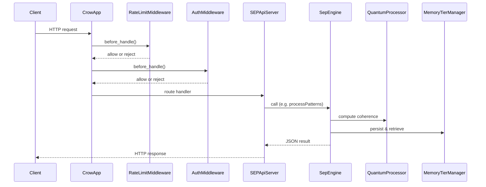

# SEP API Implementation Overview

This document outlines how HTTP requests travel through the SEP Engine's API layer and how the API hooks into lower modules.

## Key Implementation Files

- `src/api/server.cpp` – boots the Crow server, configures middleware, and registers routes.
- `src/api/sep_engine.cpp` – facade that connects to quantum processing and the memory manager.
- `src/api/auth_middleware.cpp` – validates bearer tokens.
- `src/api/rate_limit_middleware.cpp` and `src/api/lock_free_rate_limiter.cpp` – enforce per-client quotas.
- `src/api/crow_adapter.cpp` – minimal adapter for exposing the engine through the Crow framework.
- `src/api/bridge.cpp` and `src/api/bridge_c.cpp` – C-compatible bridge used by `js_integration.cpp`.
- `src/api/client.cpp` and `src/api/curl_http_client.cpp` – outgoing HTTP client used by `ollama_client.cpp`.

## Request Flow

## Middleware Responsibilities

- **RateLimitMiddleware** wraps a lock-free rate limiter. When enabled, it checks each request and returns a `429` response if the limit is exceeded.
- **AuthMiddleware** optionally verifies a list of bearer tokens. If no tokens are configured, all requests pass through.

## Connections to Core and Quantum Modules

`SepEngine` instantiates a `QuantumProcessor` and a `PatternProcessor` while holding a reference to the `MemoryTierManager` singleton. Route handlers in `server.cpp` delegate to `SepEngine` methods which in turn invoke quantum algorithms and manage pattern history. Responses may be modulated for coherence before being returned.

Bridging files expose similar capabilities through a C ABI so that external languages can interact with the engine without linking against C++ directly.

