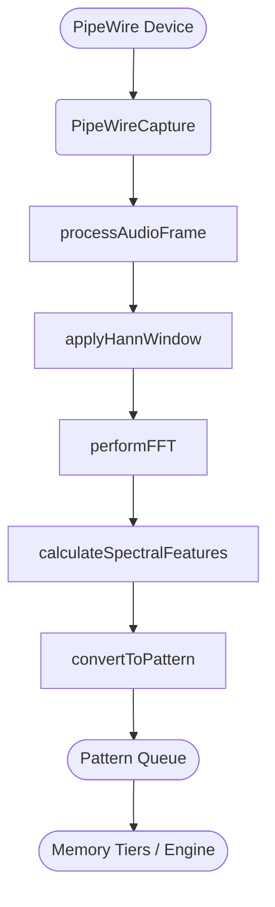

# Audio Pipeline Flow

This diagram outlines how audio data moves through the SEP engine. Raw samples originate from a PipeWire stream and are transformed into pattern vectors that other modules consume.

## Stages
1. **PipeWireCapture** – Connects to a PipeWire device and reads audio frames.
2. **AudioPipeline** – Buffers frames, applies a Hann window, runs an FFT, and extracts spectral features.
3. **Pattern Conversion** – Spectral features are mapped into `glm::vec3` pattern vectors which are enqueued for the engine.

