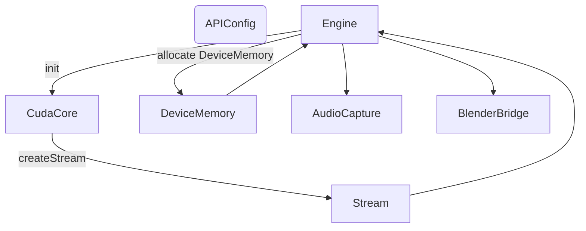
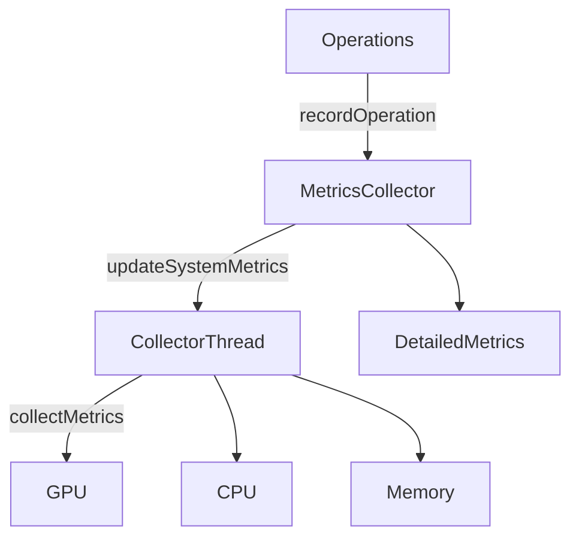
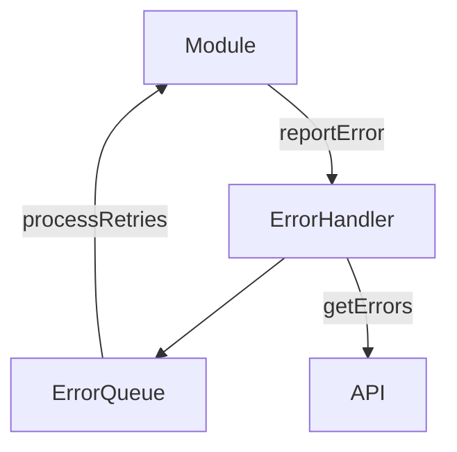
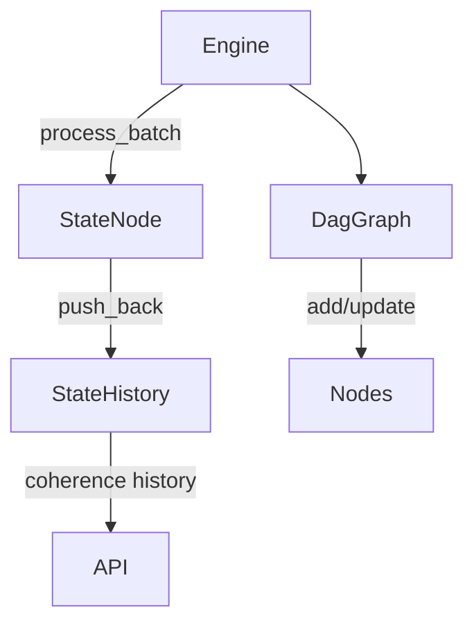

# Core Data Flow Overview

This document illustrates how data moves through the main subsystems inside `src/core`.
Each section provides a high level flowchart describing the major interactions.

## Engine Initialization

- The `Engine` loads configuration, initializes the CUDA runtime via `CudaCore`, and creates the default stream.
- Device memory buffers are allocated for bitfields, probe indices, expectations, and other working data.
- Optional subsystems such as audio capture and the Blender bridge are created if available.
- Once complete, the engine is ready to process batches of quantum state data.

## Metrics Collection

- User operations call `recordOperation`, `incrementCounter`, or `setGauge` which update in-memory metrics.
- A background collector thread periodically gathers GPU, CPU, and memory usage, storing the latest values in `DetailedMetrics`.
- Kernel start/stop events feed execution timing information back into the metrics structures.

## Error Handling

- Any module can report an error with optional retry logic to the singleton `ErrorHandler`.
- Errors are stored in an internal queue. On each report, the handler attempts retries up to three times.
- External callers can query or clear the error list via the API layer.

## DAG Graph System

- During batch processing, the engine computes collapse indices and coherence information, creating a new `StateNode`.
- The node is appended to `StateHistory`, allowing inspection of coherence over time.
- A separate `DagGraph` tracks relationships between patterns, storing parent links and coherence values.
- Clients can access both the state history and graph data to visualize system evolution.
