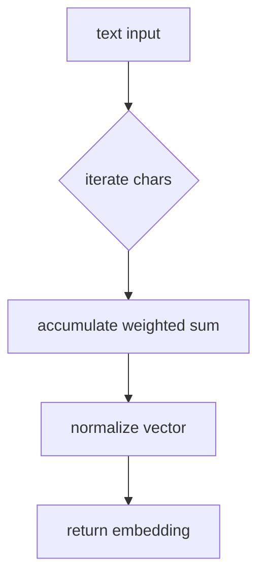
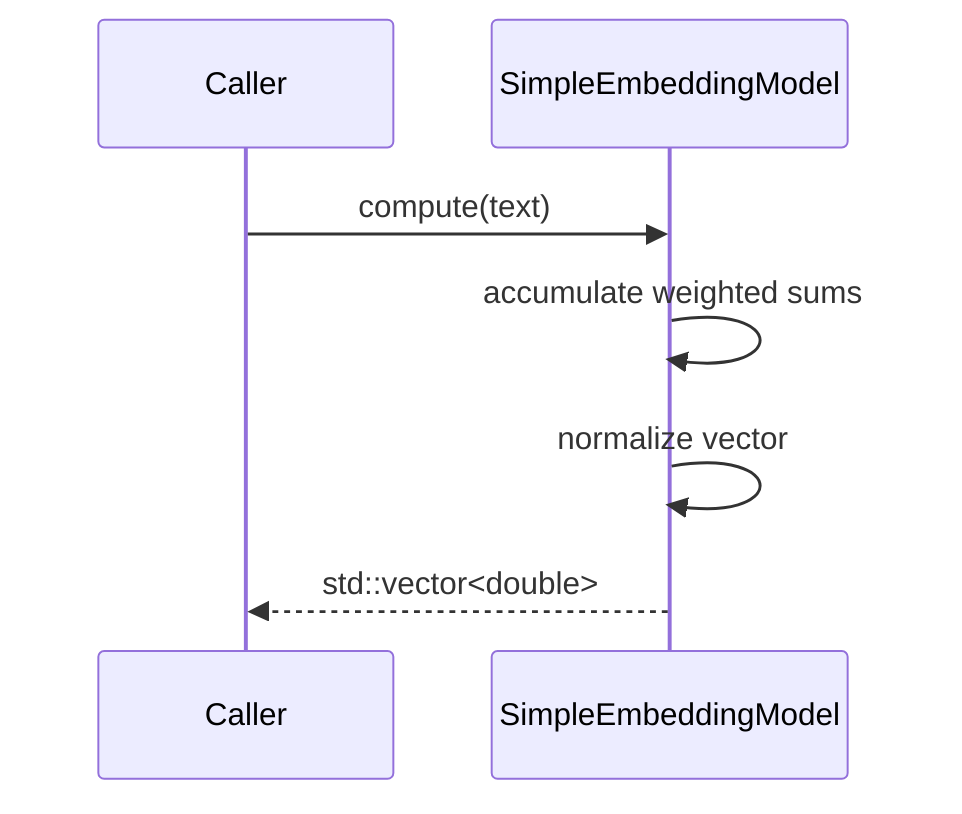

# Embedding Source Flow

The `src/embeddings` folder currently contains a single implementation file providing a toy text embedding model.

`simple_embedding_model.cpp` multiplies each character code by a constant weight vector and normalizes the result. The function is deterministic and serves as a placeholder until a real model is integrated.

## Processing Steps

1. **Initialization**: The constructor fills `weights_` with deterministic constants.
2. **Accumulation**: `compute` iterates over characters, multiplies by each weight and sums into a vector of length `kDim`.
3. **Normalization**: After accumulation the vector is normalized to unit length.

The CMake file exports this object as `sep_embeddings`, allowing other modules to link against the library.
